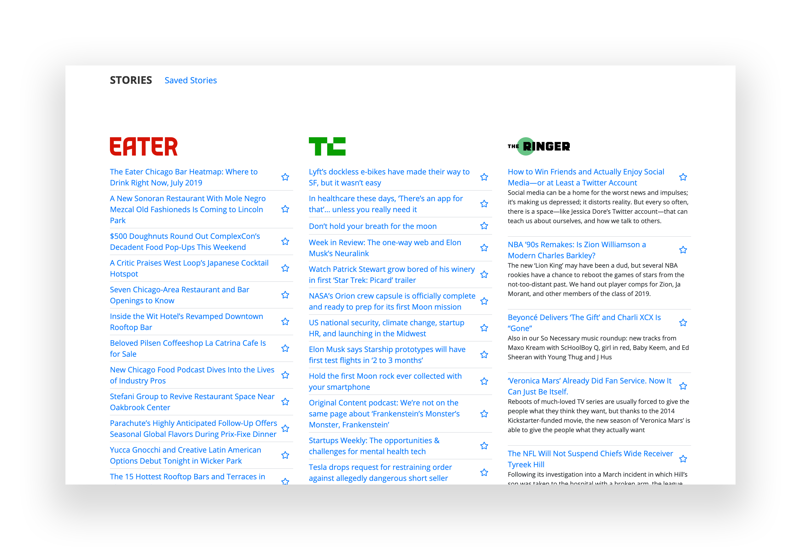
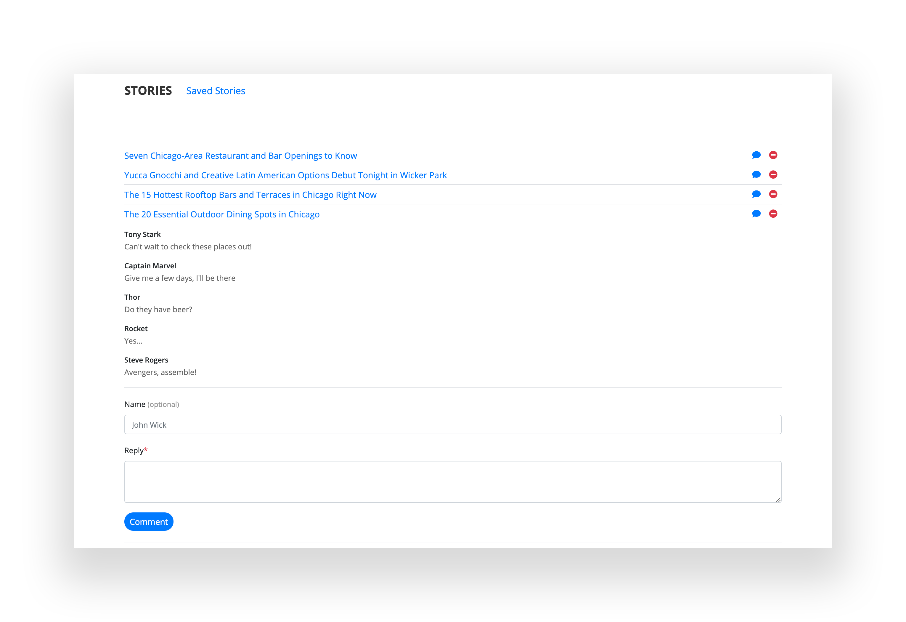

# Stories

[Stories](http://sleepy-dusk-11571.herokuapp.com/) is a web app that lets users view and leave comments on the latest news. It aggregates stories from [Eater Chicago](https://chicago.eater.com/), [TechCrunch](https://techcrunch.com/), and [The Ringer](https://www.theringer.com/), and it allows you to save stories to read later.



## Features

A few things you can do with Stories:

* View the latest headlines and snippets from your favorite websites
* Stories are refreshed whenever you open the app
* Save stories for later
* Add comments to saved stories



## Development

Getting started 

  1. Clone this repository on GitHub with `git clone https://github.com/jlouie10/stories.git`
  2. Run `npm install` to install dependencies
  3. Run `mongod` and `mongo` to run MongoDB
  3. Run `npm start` to start your web server

## Issues

* `GET /api/stories` and `GET /api/v3/scrape` should return stories sorted with the most recent appearing first
* the [TechCrunch](https://techcrunch.com/) website does not load summaries when the website is scraped
* comments have a `DELETE` method, but no UI to request this method
* `event.preventDefault()` strips inline error handling (i.e. text is required when submitting a comment, but the error is not displayed to the user)
* when scraping for the first time by loading the app, the first story for [The Ringer](https://www.theringer.com/) is "We're building great things, and we need your talent."

## Technologies Used

* Node.js
* JavaScript
* Node packages
    * Express
    * Express Handlebars
    * Mongoose
    * cheerio
    * axios
    * nodmon
* MongoDB
    
---

# API Reference

## Scrape

* Returns a list of *new* scraped stories. The stories are returned in sorted order, with the oldest stories appearing first. Scrapes [Eater Chicago](https://chicago.eater.com/), [TechCrunch](https://techcrunch.com/), and [The Ringer](https://www.theringer.com/), and compares scraped stories with existing stories.
* v1 implements the original scrape method, creating documents one at a time for every story scraped; this method logs an error for every duplicate story
* v2 improves on v1 by comparing scraped stories to existing stories and creating documents at once
* v3 batches requests to axios for scraping multiple websites

### Endpoints

* `GET /api/v3/scrape`
* `GET /api/v2/scrape` _deprecated_
* `GET /api/v1/scrape` _deprecated_

* ```
  GET /api/v3/scrape
  ```

* Response:

  ```
  [
      {
          "bookmark": false,
          "comments": [],
          "summary": "Is the best Disney song of all time from ‘The Lion King’? ‘The Little Mermaid’? ‘Mulan’? Ringer staffers debate.",
          "_id": "5d34d2de0302d1423623978d",
          "title": "What Is the Best Disney Song?",
          "link": "https://www.theringer.com/video/2019/7/17/20697578/what-is-best-disney-song",
          "__v": 0
      }
  ]
  ```

## Stories

### Endpoints

* `GET /api/stories/:_id`
* `POST /api/stories/:_id`
* `GET /api/stories`

### Retrieve a story

* ``` 
  GET /api/stories/:_id
  ```

* Response:

  ```
  [
    {
      "bookmark": false,
        "comments": [],
        "summary": "Is the best Disney song of all time from ‘The Lion King’? ‘The Little Mermaid’? ‘Mulan’? Ringer staffers debate.",
        "_id": "5d34d2de0302d1423623978d",
        "title": "What Is the Best Disney Song?",
        "link": "https://www.theringer.com/video/2019/7/17/20697578/what-is-best-disney-song",
        "__v": 0
    }
  ]
  ```

### Update a story

* Arguments
  * bookmark

* ```
  POST /api/stories/:_id
  ```

  ```
  {
    "bookmark": true
  }
  ```

* Response:

  ```
  {
    "bookmark": true,
    "comments": [],
    "summary": "Is the best Disney song of all time from ‘The Lion King’? ‘The Little Mermaid’? ‘Mulan’? Ringer staffers debate.",
    "_id": "5d34d2de0302d1423623978d",
    "title": "What Is the Best Disney Song?",
    "link": "https://www.theringer.com/video/2019/7/17/20697578/what-is-best-disney-song",
    "__v": 0
  }
  ```

### List all stories

* ```
  GET /api/stories
  ```

* Response:

  ```
  [
    {
        "bookmark": false,
        "comments": [],
        "summary": "Episode 2 of ‘Break Stuff’ explores the 1969 festival, which wasn’t everything the famous documentary would have you believe",
        "_id": "5d34d2de0302d14236239790",
        "title": "Everything You Know About the First Woodstock Is Wrong",
        "link": "https://www.theringer.com/2019/7/16/20695623/episode-2-break-stuff-woodstock-99-podcast-mass-electrocution",
        "__v": 0
    },
    {
        "bookmark": false,
        "comments": [],
        "summary": "We’re halfway through the season without a consensus hip-hop anthem to blast until fall—or are we? Here, Ringer staffers nominate their choices for the hottest track of right now.",
        "_id": "5d34d2de0302d1423623978f",
        "title": "What Is the 2019 Rap Song of Summer?",
        "link": "https://www.theringer.com/music/2019/7/17/20697407/best-rap-song-summer-2019-dababy-megan-thee-stallion-lizzo-nav-meek-mill",
        "__v": 0
    }
  ]
  ```

## Comments

### Endpoints

* `POST /api/comments`
* `GET /api/comments/:_id`
* `DELETE /api/comments/:_id`
* `GET /api/comments`

### Create a comment

* Arguments
  * author
  * story
    * `_id` of the story the comment is created under
  * text

* ```
  POST /api/comments
  ```

  ```
  {
    "author": "Tony Stark",
    "story": "5d34d2de0302d1423623978d",
    "text": "I like this story"
  }
  ```

* Response:

  ```
  {
    "author": "Tony Stark",
    "_id": "5d34d889a8737554d697f9e5",
    "story": "5d34d2de0302d1423623978d",
    "text": "I like this story",
    "__v": 0
  }
  ```

### Retrieve a comment

* ``` 
  GET /api/comments/:_id
  ```

* Response:

  ```
  [
    {
        "author": "Tony Stark",
        "_id": "5d34d889a8737554d697f9e5",
        "story": "5d34d2de0302d1423623978d",
        "text": "I like this story",
        "__v": 0
    }
  ]
  ```

### Delete a comment

* ``` 
  DELETE /api/comments/:_id
  ```

* Response:

  ```
  {
    "n": 0,
    "ok": 1,
    "deletedCount": 0
  }
  ```

### List all comments

* ```
  GET /api/comments
  ```

* Response:

  ```
  [
    {
        "author": "Tony Stark",
        "_id": "5d34d889a8737554d697f9e5",
        "story": "5d34d2de0302d1423623978d",
        "text": "I like this story",
        "__v": 0
    },
    {
        "author": "Groot",
        "_id": "5d34d918a8737554d697f9e6",
        "story": "5d34d2de0302d1423623978d",
        "text": "I am Groot",
        "__v": 0
    }
  ]
  ```